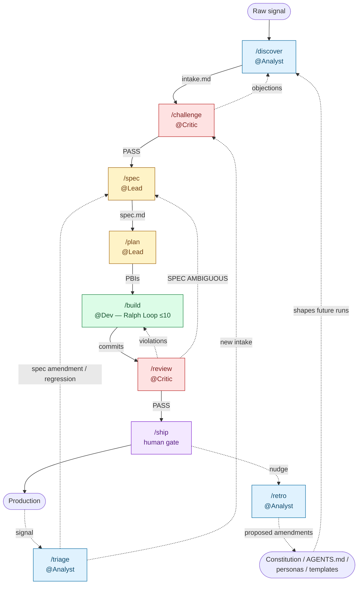

<!-- BEGIN:nextjs-agent-rules -->

# This is NOT the Next.js you know

This version has breaking changes — APIs, conventions, and file structure may all differ from your training data. Read the relevant guide in `node_modules/next/dist/docs/` before writing any code. Heed deprecation notices.

<!-- END:nextjs-agent-rules -->

## Stack — what training data lies about

Things you can't safely infer from `package.json` and config files alone:

- **Next.js 16** — App Router only. React Compiler is **enabled** (`next.config.ts` → `reactCompiler: true`); do not hand-write `useMemo`/`useCallback` for memoization the compiler already handles.
- **Tailwind CSS v4** — uses the PostCSS pipeline (`@tailwindcss/postcss`), not the v3 config file.
- **Vitest setup** — `vitest.setup.ts` registers `@testing-library/jest-dom` matchers and runs `cleanup()` after each test. No need to wire those per-test.

Local docs (read before changing framework-touching code):

- `node_modules/next/dist/docs/01-app/` — App Router (the one we use)
- `node_modules/next/dist/docs/02-pages/` — Pages Router (we do **not** use it)

## Repo layout

Standard Next.js App Router. The architecturally interesting directories:

- `src/app/widgets/<widget-name>/` — self-contained widget folders (`page.tsx` + components + tests, all colocated)
- `src/app/layout.tsx` — owns shared page chrome (see Architecture)
- `src/lib/` — universal utilities only (`cn()`, env). Kept tiny on purpose.
- `.specs/<domain>/` — living specs and PBIs
- `.claude/agents/` — persona subagents
- `.claude/commands/` — slash command definitions

## Architecture

This is a **practice platform** for agentic coding. Learners build small widgets based on their own ideas — experimenting with prompts, agents, slash commands, and the factory pipeline against real Next.js code. The repo is **not a tutorial**: there are no lessons, no prescribed exercises, and no "right answer" the platform is steering anyone toward. Its job is to stay out of the way while many learners hack on independent widgets in parallel, without breaking each other or the framework.

The platform's **architectural invariants** (cross-widget isolation, no-DRY-across-widgets, `lib/` discipline, etc.) live in `.specs/CONSTITUTION.md` and are checked by the Critic on every `/review`. The bullets below are the prose explanation of those invariants; the Constitution is the machine-checked contract.

Architecture optimizes for **isolation, parallelism, and sensible Next.js conventions** — not production scale, not DRY reuse, not pedagogy.

- **Widgets are self-contained.** Each widget lives in its own folder under `src/app/widgets/<widget-name>/` with its `page.tsx`, components, and tests colocated. Everything a widget needs sits inside its folder.
- **Duplicate freely; do not DRY across widgets.** Shared `lib/`, shared UI primitives, and cross-widget imports become merge-conflict hotspots and let one learner's refactor break someone else's widget. If two widgets look similar, leave them similar — each widget must remain deletable in one `rm -rf`.
- **No shared mutable state across widgets.** No global store, no shared DB schema, no cross-widget imports. A broken widget must not cascade.
- **`lib/` stays tiny and stable.** Only truly universal utilities (e.g. `cn()`, env access). Treat additions to `lib/` as a load-bearing decision, not a convenience.
- **Sensible Next.js, no exotic layering.** App Router only, server components by default, `next/font` for fonts, Tailwind utilities first, `@/*` alias for imports. Do not introduce `features/`, `server/`, or other layered directories.
- **Flat beats clever.** The repo shape is deliberately boring; the interesting part is what learners do inside their widget folder.
- **`layout.tsx` owns shared page chrome only** — page background, container max-width (`1280px`), horizontal gutters (`58.5px`), top padding, and `next/font/google` variables. Widgets that need different chrome opt out at their own `page.tsx` by rendering an outer wrapper that overrides those utilities.

### Requirements in a practice platform

The learner is the stakeholder. Whatever the learner wants to build is a legitimate source of requirements. There are no real end users, no production signals, no curriculum.

That changes what evidence means at the `/challenge` gate. The legitimate source of an "ask" is **the learner's own stated intent**, captured in the intake as a quoted goal. The Critic does **not** demand external evidence ("did a real user ask for this?") because none exists.

The Critic still gates on:

- **Coherence** — is the learner's stated intent internally consistent with what's being proposed?
- **Scope** — is this still a single widget, deletable in one `rm -rf`, not bundling unrelated ideas?
- **Next.js architecture** — does the proposal stay within App Router conventions, server-first defaults, no exotic layering?
- **Alternatives** — is there a simpler shape that still satisfies the learner's intent?

Objections of the form "no user asked for X" or "this widget doesn't teach anything" are **not** valid blockers in this repo.

## Scripts

| Action          | Command            | Notes                    |
| --------------- | ------------------ | ------------------------ |
| Dev             | `npm run dev`      |                          |
| Build           | `npm run build`    |                          |
| Lint            | `npm run lint`     |                          |
| Test (one-shot) | `npm run test:run` | Gate invoked by `/build` |
| Test (watch)    | `npm run test`     |                          |

Quality gate inside `/build` is `lint` + `tsc --noEmit` (implicit) + `test:run`.

## Conventions (judgment, not toolchain)

- **Server components by default.** Add `"use client"` only when the component needs interactivity, browser APIs, or React state/effects.
- **Tests colocated** as `*.test.ts(x)` next to the code (template: `src/smoke.test.tsx`). Use Testing Library queries.
- **CSS Modules only for genuinely scoped, non-utility cases** (see `page.module.css`). Tailwind is the default.
- **Fonts via `next/font/google`** — never `<link rel="stylesheet">`.
- **No `--no-verify`, no `// @ts-ignore`, no skipped tests** to make a gate pass (factory rule).

## Personas & slash commands

Subagents in `.claude/agents/`: `analyst`, `lead`, `dev`, `critic` (`@Analyst`, `@Lead`, `@Dev`, `@Critic`). Each runs in its own context window with a tool allowlist that enforces persona boundaries; the main thread orchestrates. Do not preload agent files.

Slash commands implement the **agentic double diamond** pipeline plus an Agent Optimization Loop. Run `/cheat-sheet` for the reference card. Definitions in `.claude/commands/`; specs in `.specs/`.

`/discover <signal>` and `/triage <signal>` are the orchestrators — they auto-chain through every phase, halting only on gate objections, the `/build` 10-iteration cap, or the pre-`/ship` boundary. `/ship` is always human-gated. `/retro <domain>` closes the second loop: after a pipeline ships (or stalls), it distills the trail into proposed amendments to the Constitution, AGENTS.md, personas, and templates — producing diffs only, never auto-applying.

### Pipeline diagram

Solid arrows are the happy path; dotted arrows are feedback / failure edges. Node colors group by persona.

